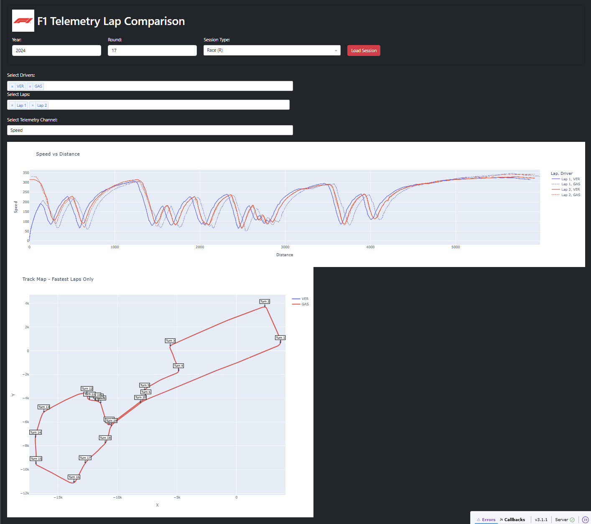
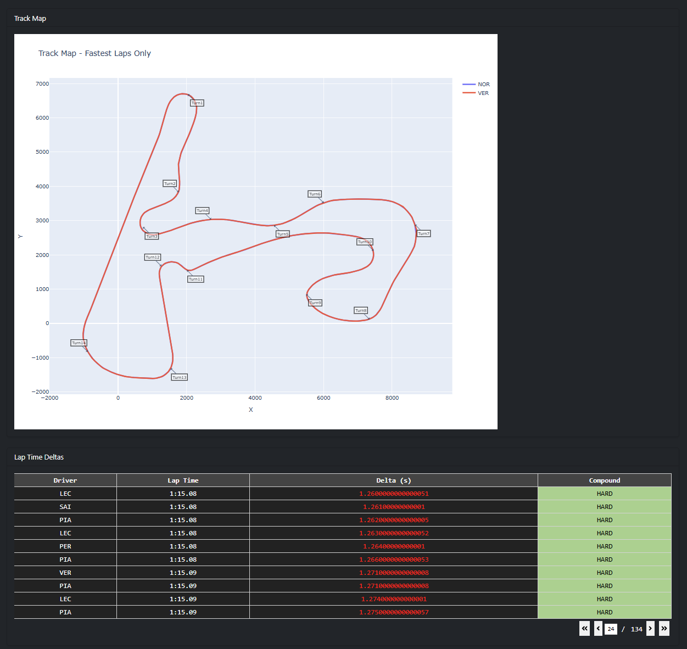
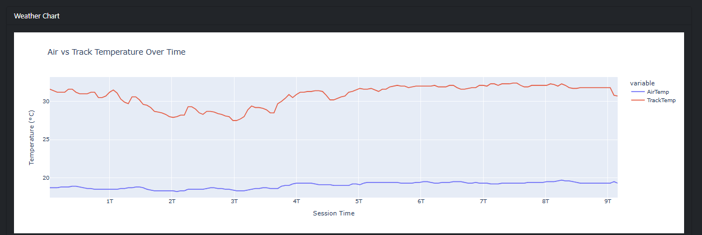

# F1 Telemetry Dashboard

A Dash app that loads telemetry data from Formula 1 sessions using FastF1.


## Features

- Select season, round, and session type (FP1, FP2, FP3, Q, S, R) via dropdown
- Load and compare telemetry from the fastest lap for multiple drivers
- View and compare key telemetry channels:
  - Speed, Throttle, Brake, RPM, Gear, DRS
- Track map with color-coded driver lines and smart turn number annotations
- Telemetry plot with interactive lap data and circuit corner markers
- Live weather chart showing air and track temperature
- Lap delta table with fastest lap times, color-coded deltas, and tire compound info
- F1-themed UI with Dash + Bootstrap (black/red/white palette)
- FastF1 caching enabled for performance

> More features coming soon: sector time deltas, strategy overlays, and more.

## Live demo

Deployed on Render: https://f1-telemetry-dashboard-bao9.onrender.com/

> Note: the app may take ~30 seconds to wake up on first load — Render's free tier spins down after inactivity. Loading full race sessions may be slow due to memory constraints on the free tier.

## Screenshots





## Run locally

```bash
git clone https://github.com/Jimsidi/f1-telemetry-dashboard.git
cd f1-telemetry-dashboard
pip install -r requirements.txt
python app/run.py
```

Then open http://127.0.0.1:8050/ in your browser.

## Tech stack

| Layer | Technology |
|---|---|
| App framework | Dash + Plotly |
| F1 data | FastF1 |
| UI components | Dash Bootstrap Components |
| Production server | Gunicorn |
| CI | GitHub Actions |
| Deployment | Render |

## CI/CD

Every push to `main` triggers the GitHub Actions workflow which installs dependencies and runs the test suite. Render auto-deploys only after CI passes.

## Project structure

```
f1-telemetry-dashboard/
├── app/
│   ├── __init__.py       # App initialization
│   ├── layout.py         # UI layout
│   ├── callbacks.py      # Dash callbacks
|   ├── utils.py          # FastF1 session loading
│   └── assets/           # Static files and screenshots
├── tests/
│   └── test_smoke.py     # Smoke tests
├── .github/
│   └── workflows/
│       └── ci.yml        # GitHub Actions CI workflow
├── run.py                # Entry point (local dev)
├── conftest.py           # Pytest path config
├── requirements.txt      # Python dependencies
└── .python-version       # Pinned Python version
```

## Contributing

Branches are required for all changes — direct pushes to `main` are blocked. Open a PR and CI must pass before merging.
