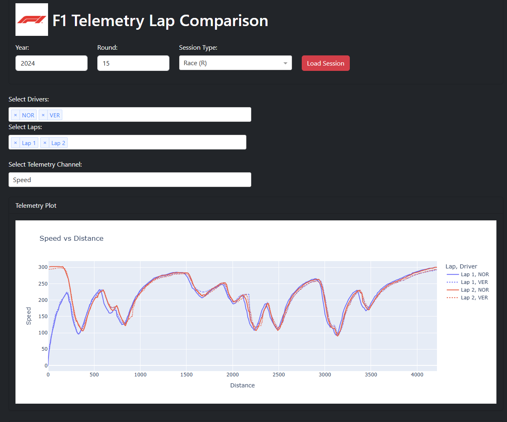

# 🏎️ F1 Telemetry Dashboard

A Dash app that loads telemetry data from Formula 1 sessions using FastF1.

## 💡 Features

- Select season, round, and session type (FP1, FP2, FP3, Q, S, R) via dropdown
- Load and compare telemetry from the fastest lap for multiple drivers
- View and compare key telemetry channels:
  - Speed, Throttle, Brake, RPM, Gear, DRS
- Track map:
  - Color-coded driver lines
  - Smart turn number annotations that alternate to avoid overlap
- Telemetry plot with:
  - Interactive lap data
  - Circuit corner markers
- Live weather chart showing:
  - Air temperature
  - Track temperature
- Lap delta table with:
  - Fastest lap times comparison
  - Color-coded deltas
  - Tire compound info with matching colors
- F1-themed UI with Dash + Bootstrap (black/red/white palette)
- Loading spinners for smoother user experience
- FastF1 caching enabled for performance

> 🛠️ More features coming soon: sector time deltas, strategy overlays, tire compounds, etc.

## 🚀 Usage

```bash
pip install -r requirements.txt
python app/run.py
```

Then go to http://127.0.0.1:8050/ in your browser.

## 📸 Screenshots


