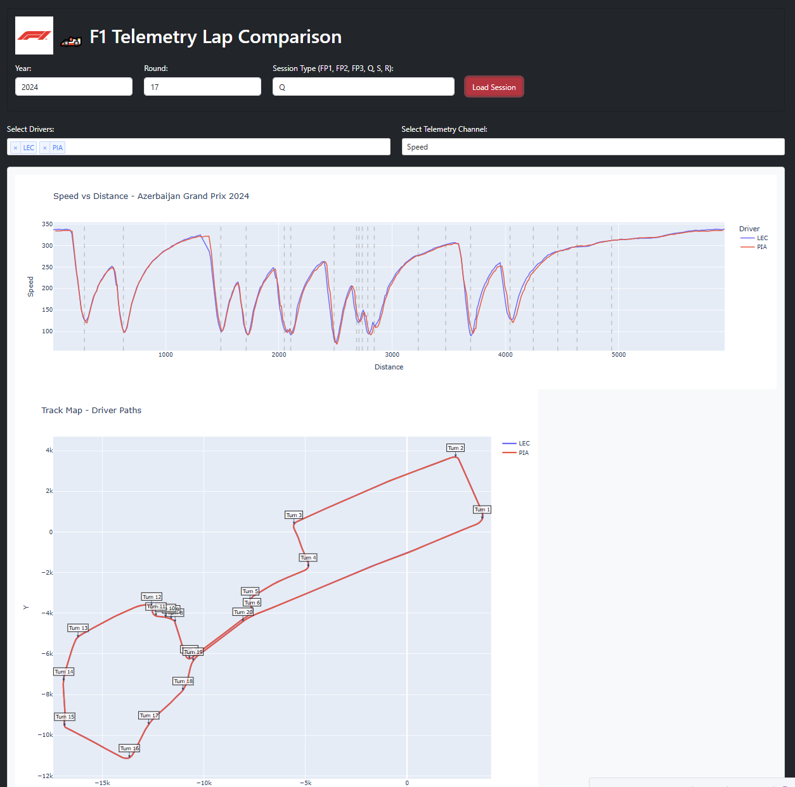

# 🏎️ F1 Telemetry Dashboard

A Dash app that loads telemetry data from Formula 1 sessions using FastF1.

## 💡 Features
- Select season, round, and session type (Q, R, FP1 etc)
- View driver telemetry for fastest lap
- Visual comparison of speed/throttle/brake/RPM/gear/DRS
- Track map with color-coded driver lines
- Corner markers and turn labels on telemetry plot
- Bootstrap-based UI theme (F1-inspired red/black/white)

> ℹ️ More features coming soon!

## 🚀 Usage

```bash
pip install -r requirements.txt
python app/f1_dashboard.py
```

Then go to http://127.0.0.1:8050/ in your browser.

## 📸 Screenshots


